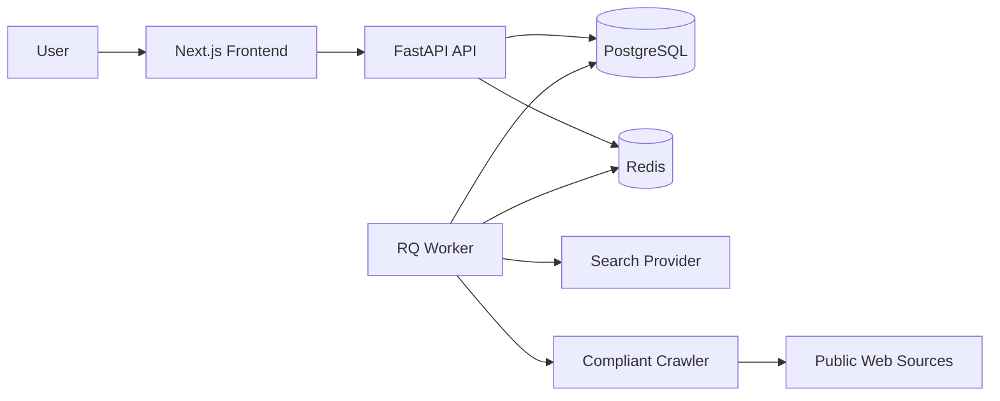

# Technical Design

## Architecture

## Stack

- Frontend: Next.js App Router, React, TypeScript, plain CSS modules/global CSS.
- Backend: FastAPI, SQLAlchemy 2, Pydantic, Alembic.
- Database: PostgreSQL.
- Queue: Redis + RQ.
- Export: CSV via standard library, XLSX via `openpyxl`.
- Deployment: Render Blueprint with web services, worker, Redis, and PostgreSQL.

## Backend Modules

- `app.main`: FastAPI application setup and router registration.
- `app.core.config`: environment settings.
- `app.core.database`: SQLAlchemy engine/session setup.
- `app.models`: database models.
- `app.schemas`: API request/response schemas.
- `app.api.routes`: HTTP endpoints.
- `app.services.research`: orchestration of research workflow.
- `app.services.keyword_expander`: keyword generation and classification.
- `app.services.search_provider`: deterministic demo provider plus provider interface.
- `app.services.crawler`: robots-aware fetch helpers.
- `app.services.dedup`: company deduplication.
- `app.worker`: RQ worker entrypoint.

## Data Model

- Project
  - seed keywords
  - status
  - timestamps
- Keyword
  - keyword text
  - category
  - confidence
  - source type
  - source URL
- Source
  - source type
  - title
  - URL
  - event name
  - publication year
  - access status
- Company
  - name
  - website
  - country
  - address
  - phone
  - email
  - status
  - confidence
  - source/event metadata
- ResearchTask
  - status
  - log
  - result counters

## Search Strategy

The MVP ships with a deterministic demo search provider so the product can run without paid search APIs. Production can implement `SearchProvider.search(query)` using providers such as Bing Web Search, SerpAPI, Google Programmable Search, Brave Search, or an internal dataset.

The research service builds query groups:

- Keyword expansion queries
- Trade show/exhibitor queries
- Magazine/directory/buyer guide queries
- Issuu-focused queries

## Crawling Rules

The crawler:

- Checks `robots.txt` before fetching.
- Uses request timeouts.
- Limits per-domain request rate.
- Retries transient failures.
- Records blocked or failed sources.
- Stops when CAPTCHA, login wall, or paywall signals are detected.

LinkedIn:

- Direct scraping is disabled.
- The system can store LinkedIn-derived terms only from search snippets, user imports, or approved data providers.

## Deduplication

Deduplication uses conservative matching:

1. Exact normalized website host match.
2. Exact normalized email domain match.
3. Exact normalized company name match.

Future versions can add fuzzy matching and review queues.

## Deployment

Render services:

- `lead-research-api`: FastAPI web service.
- `lead-research-worker`: background worker.
- `lead-research-web`: Next.js web service.
- Managed PostgreSQL.
- Managed Redis.

GitHub Actions:

- Backend syntax/import check and tests.
- Frontend install/build check.

## Environment Variables

See `.env.example`.
